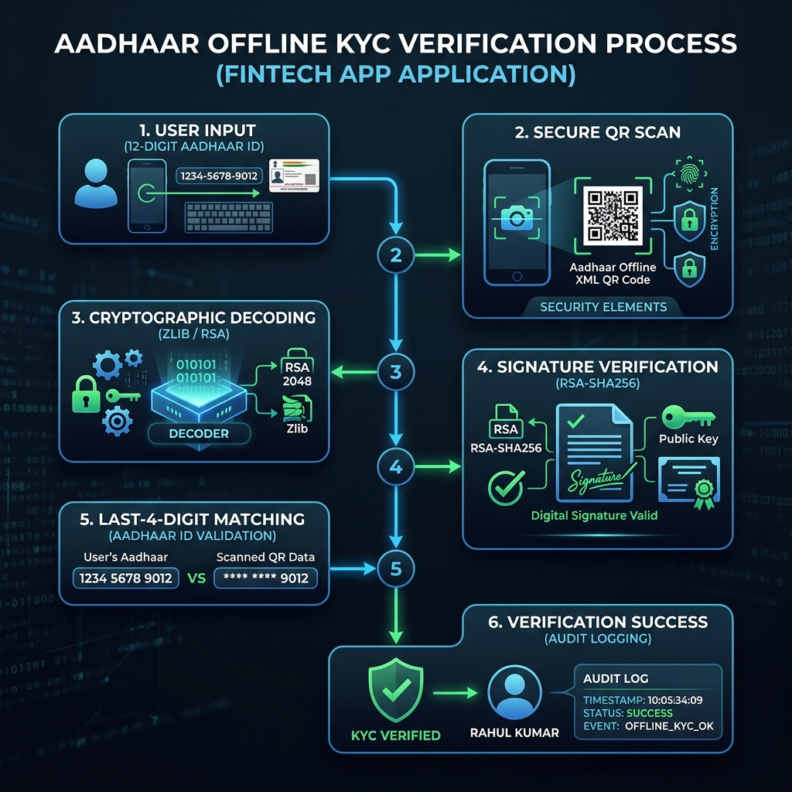

# Aadhaar Offline Verification & Risk Intelligence Platform



## 🚀 Overview

An enterprise-grade, high-volume identity verification platform built for UIDAI Offline Compliance. This system processes degraded Aadhaar documents (B/W, blurred, rotated) and produces real-time risk intelligence scores.

### Key Features

- **100% Offline Verification**: No API calls to UIDAI, ensuring data privacy and compliance.
- **Multi-Source Engine**: Supports Images (JPG/PNG), PDFs (password-protected), and XML/ZIP.
- **Smart Preprocessing**: Automatic grayscale, contrast enhancement, and deskewing.
- **QR Cascade Decoder**: Multi-library attempt logic (pyzbar + zxing-cpp) for maximum success rate.
- **Risk Intelligence**: Proprietary scoring engine based on signal quality and demographic completeness.
- **Interactive Dashboard**: Premium UI for monitoring and manual verification.

---

## 🏗️ Technical Architecture

The platform follows a layered, service-oriented architecture:

- **API Layer**: FastAPI 0.111+
- **Worker Layer**: Celery + Redis for bulk processing
- **Data Layer**: PostgreSQL 15+ (Audit & Results)
- **Engines**: OpenCV, zxing-cpp, lxml, pikepdf

For detailed specifications, see the [Full TDD & IDD](docs/tdd_idd.md).

---

## 🛠️ Quick Start

### 1. Prerequisites

- Docker & Docker Compose
- Python 3.11+ (for local development)

### 2. Startup

```bash
# Clone the repository
git clone https://github.com/Tashima-Tarsh/aadhaar-verification-engine.git
cd aadhaar-verification-engine

# Initialize environment
cp .env.example .env

# Start with Docker
docker-compose up --build
```

### 3. Access

- **Interactive UI**: [http://localhost:8000/dashboard](http://localhost:8000/dashboard)
- **API Docs**: [http://localhost:8000/docs](http://localhost:8000/docs)

---

## 📊 Risk Scoring Logic

Signals are weighted to produce a classification:

- **LOW**: Score 0-20 (Auto-approved)
- **MEDIUM**: Score 21-45 (Manual review recommended)
- **HIGH**: Score 46-100 (Flagged for investigation)

---

## 🛡️ Security & Compliance

- **Masking**: Aadhaar numbers are always masked as `XXXX-XXXX-NNNN`.
- **Encryption**: Photos encrypted at rest (AES-128-CBC).
- **Audit**: Immutable trail for every verification attempt.

---

## 📄 License

CONFIDENTIAL — INTERNAL ONLY
