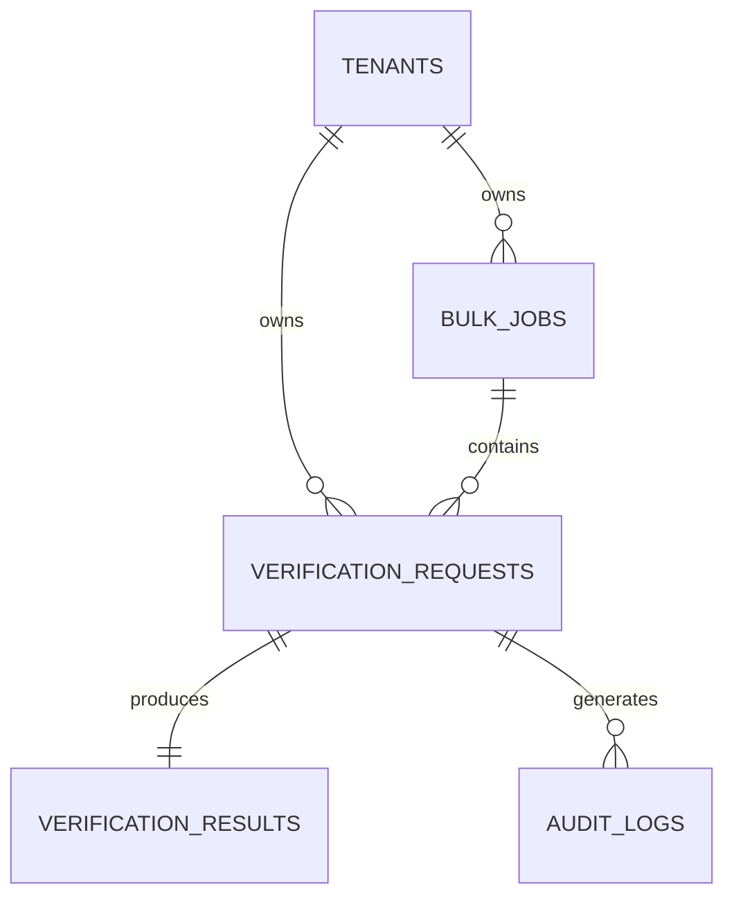

# Database Schema — Aadhaar Offline Verification Platform

The platform uses PostgreSQL for structured data persistence, following a multi-tenant design to isolate records between different enterprise clients.

---

## 1. Entity Relationship Overview
The schema is designed for high-throughput logging and traceability.

---

## 2. Table Definitions

### 2.1 Table: `tenants`
Stores enterprise client configuration and API credentials.
| Column | Type | Description |
|--------|------|-------------|
| `id` | UUID (PK) | Primary Identifier |
| `name` | String | Enterprise Name |
| `api_key_hash` | String | Hashed API Key for auth |
| `webhook_url` | String | Default endpoint for results |
| `webhook_secret`| String | Secret for HMAC signing |
| `created_at` | DateTime | Creation timestamp |

### 2.2 Table: `verification_requests`
Stores every individual verification attempt.
| Column | Type | Description |
|--------|------|-------------|
| `id` | UUID (PK) | Request ID |
| `tenant_id` | UUID (FK) | Reference to Tenant |
| `bulk_job_id` | UUID (FK, Opt) | Reference to Bulk Job |
| `reference_id` | String | Client-provided ID |
| `status` | Enum | PENDING, PROCESSING, COMPLETED, FAILED |
| `source_type` | String | IMAGE, PDF, XML, ZIP |
| `risk_score` | Integer | Calculated 0-100 score |
| `created_at` | DateTime | Timestamp |

### 2.3 Table: `verification_results`
Stores the extracted and validated demographic data.
| Column | Type | Description |
|--------|------|-------------|
| `id` | UUID (PK) | Result ID |
| `request_id` | UUID (FK) | Reference to Request |
| `full_name` | String | Extracted Name |
| `masked_uid` | String | Masked Aadhaar (XXXX-XXXX-NNNN) |
| `dob` | Date | Date of Birth |
| `gender` | String | M/F/T |
| `address_json` | JSONB | Normalized Address |
| `photo_blob_id`| String | Reference to encrypted storage |

### 2.4 Table: `bulk_jobs`
Manages batches of verifications.
| Column | Type | Description |
|--------|------|-------------|
| `id` | UUID (PK) | Job ID |
| `tenant_id` | UUID (FK) | Reference to Tenant |
| `total_count` | Integer | Total records in batch |
| `processed_count`| Integer| Current progress |
| `status` | Enum | QUEUED, IN_PROGRESS, COMPLETED |

### 2.5 Table: `audit_logs`
Immutable trail for compliance.
| Column | Type | Description |
|--------|------|-------------|
| `id` | UUID (PK) | Log ID |
| `request_id` | UUID (FK) | Reference to Request |
| `event_type` | String | ENGINE_START, QR_DECODED, SIG_VALIDATED |
| `event_metadata`| JSONB | Latency, IP, System info |
| `timestamp` | DateTime | Event time |
